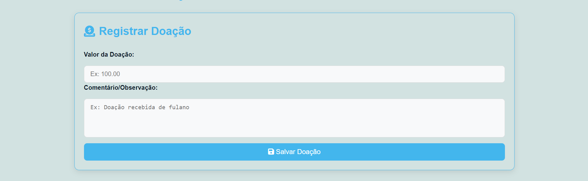
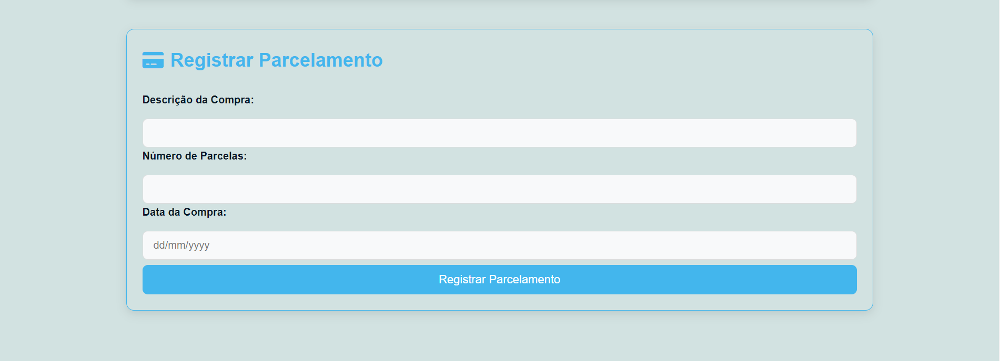

# Controle de Caixa - Missão Colo de Mãe

**Descrição:** Um sistema simples para gerenciar doações, gastos e parcelamentos, com um histórico de transações e controle de saldo em caixa.

## Funcionalidades

- **Registrar Doações:** Permite registrar doações com um valor e uma descrição.
- **Registrar Gastos:** Permite registrar gastos, garantindo que o saldo em caixa seja suficiente.
- **Registrar Parcelamento:** Permite registrar compras parceladas com data e descrição.
- **Histórico de Transações:** Exibe uma lista de todas as transações realizadas, com opções de editar e deletar.
- **Controle de Saldo:** Atualiza automaticamente o saldo em caixa com base nas transações registradas.

## Screenshots

### Tela Inicial


### Registro de Doações


### Registro de Gastos


### Registro de Parcelamento


### Histórico de Transações


## Tecnologias Utilizadas

- HTML
- CSS
- JavaScript
- LocalStorage

## Como Executar o Projeto

1. Clone o repositório:
   ```bash
   https://github.com/rma98/controle-financeiro-mcm.git

2. Navegue até a pasta do projeto:
   ```bash
   controle-financeiro-mcm

3. Abra o arquivo index.html em um navegador.

## Contribuições
Contribuições são bem-vindas! Sinta-se à vontade para abrir um problema ou enviar um pull request.

## Planejamento Futuro
- Implementar lembretes ou notificações na seção de Registrar Parcelamento.
- Adicionar comunicação com um backend (MySQL) para persistência de dados.

## Licença
Este projeto está licenciado sob a MIT License - consulte o arquivo LICENSE para mais detalhes.
